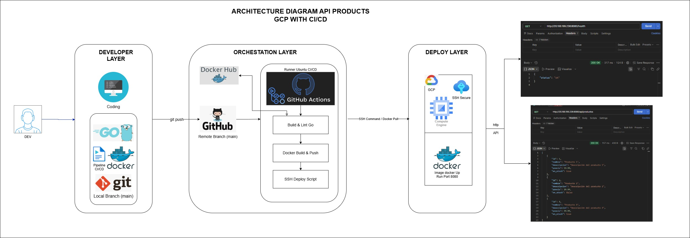

# 🚀 Go High-Performance Backend & GitOps CI/CD (V1.0)

Este repositorio contiene el núcleo base de una arquitectura backend de alto rendimiento desarrollada en **Go nativo** (sin frameworks externos), completamente contenerizada y desplegada de forma automatizada mediante un pipeline de **CI/CD (GitOps)** en una instancia virtual Linux (Debian) alojada en la nube.

---

## 📐 Arquitectura del Sistema



*Nota: Arquitectura diseñada a medida para ilustrar el flujo GitOps de extremo a extremo.*

---

## 🛠️ Stack Tecnológico Utilizado

| Capa | Tecnología | Propósito |
| :--- | :--- | :--- |
| **Backend** | `Go (Golang) 1.26` | API de alta velocidad, concurrente y nativa sin dependencias externas. |
| **Contenerización** | `Docker` | Encapsulamiento del binario compilado en entornos aislados e idénticos. |
| **Orquestación CI/CD** | `GitHub Actions` | Automatización del ciclo de vida (Build, Test, Push y Deploy). |
| **Infraestructura Cloud** | `GCP Compute Engine` | Servidor virtual (Instancia Debian Linux) para entornos de producción. |
| **Seguridad de Red** | `SSH Keys / TCP` | Túneles seguros y autenticación asimétrica desatendida. |
| **Pruebas de Consumo** | `Postman / Curl` | Validación de endpoints en tiempo real. |

---

## ✅ Capacidades Clave del Proyecto (V1.0)

*   🟩 **Endpoints de Alto Rendimiento:** Rutas `/health` y `/api/productos` resolviendo respuestas en milisegundos con codificación nativa `encoding/json`.
*   🟩 **Estructuras en Memoria:** Manejo eficiente del estado mediante `slices` dinámicos optimizados en Go.
*   🟩 **Automatización GitOps Extrema:** Flujo de despliegue automatizado activado inmediatamente tras cada `git push` a la rama `main`.
*   🟩 **Infraestructura Inmutable:** Empaquetamiento desacoplado que garantiza que lo que funciona en local funciona exactamente igual en la nube.

---

## 🧠 Desafíos Técnicos, Retos y Soluciones

Construir esta infraestructura desde cero presentó retos complejos que requirieron profundizar en conceptos de redes, seguridad y ciclo de vida de contenedores.

### 1. El Laberinto de la Autenticación SSH en Entornos Automáticos
*   ❌ **El Reto:** Bloqueos de acceso constantes (`Permission denied`) al intentar conectar de forma desatendida el Runner automático de GitHub con el servidor Debian en la nube.
*   🛡️ **La Solución:** Correcta implementación de criptografía asimétrica. Se resguardó la **Llave Privada** dentro de *GitHub Secrets* para firmar los accesos y se inyectó la **Llave Pública** correspondiente en el archivo `authorized_keys` del servidor GCP.
*   🧠 **Aprendizaje:** Comprensión profunda del apretón de manos (*handshake*) sobre TCP y cómo opera la seguridad de llaves sin intervención humana.

### 2. Orquestación y Automatización del Ciclo de Vida en Docker
*   ❌ **El Reto:** Fallos críticos en el pipeline al intentar levantar el nuevo contenedor con el código actualizado mientras el contenedor obsoleto seguía activo, causando colisiones en el puerto `8080`.
*   🛡️ **La Solución:** Diseño de un script de despliegue secuencial e **idempotente**. Mediante comandos encadenados (`docker stop ... || true` y `docker rm ... || true`), el pipeline se asegura de limpiar el entorno antes de instanciar el nuevo contenedor.
*   🧠 **Aprendizaje:** Manejo defensivo de scripts en entornos de producción y control absoluto del estado de los contenedores.

### 3. Abstracción del Archivo de Workflow (YAML)
*   ❌ **El Reto:** Sintaxis de GitHub Actions extremadamente estricta. Errores menores de indentación o variables mal mapeadas rompían la ejecución secuencial del pipeline.
*   🛡️ **La Solución:** Adopción estricta de una mentalidad de *Infraestructura como Código* (IaC), aislando y validando secuencialmente cada bloque (`job`) de ejecución.
*   🧠 **Aprendizaje:** Automatización de flujos limpios, modulares y reutilizables en entornos en la nube.

---

## 🚀 Cómo Implementar y Probar este Proyecto

### 1. Requisitos Previos
Antes de comenzar, asegúrate de tener instalado en tu máquina local:
*   Go (Versión 1.22 o superior)
*   Git
*   Docker

---


### 2. Clonar el Repositorio
El primer paso es descargar el código fuente a tu máquina local y posicionarte dentro del directorio del proyecto. Ejecuta el siguiente comando en tu terminal:

```bash
git clone https://github.com/francisco-riquelme/mi-api-gcp.git

cd mi-api-gcp

```

---

### 3. Ejecución Nativa con Go

Si deseas arrancar la aplicación de forma directa utilizando el entorno de ejecución de Go sin configurar contenedores, utiliza el comando `go run`:

```bash
go run main.go

```

---

### 4. Ejecución Contenerizada con Docker

Si prefieres empaquetar la aplicación y probar el comportamiento del contenedor tal como opera en el servidor de producción, compila la imagen localmente y levanta el contenedor mapeando el puerto `8080`:

```bash
# Compilar la imagen Docker local
docker build -t go-api-products .

# Levantar el contenedor en el puerto 8080
docker run -d -p 8080:8080 --name mi-api-go go-api-products

```

---

### 5. Verificación de Endpoints en Local

Una vez que el servidor esté corriendo (ya sea por vía nativa o por Docker), abre una nueva pestaña de tu terminal o usa Postman para verificar que la API responde correctamente en `localhost:8080`:

```bash
# Verificar el estado de salud del servidor
curl http://localhost:8080/health

# Listar los productos estructurados en memoria
curl http://localhost:8080/api/productos

```

---

> 💡 **Nota de Cierre:** Espero seguir evolucionando este proyecto incorporando persistencia con PostgreSQL, Docker Compose y un proxy inverso con Nginx en las próximas fases del roadmap.

